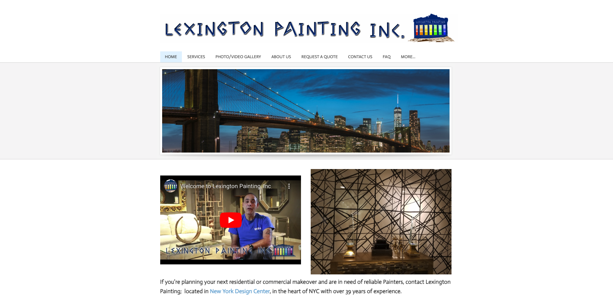
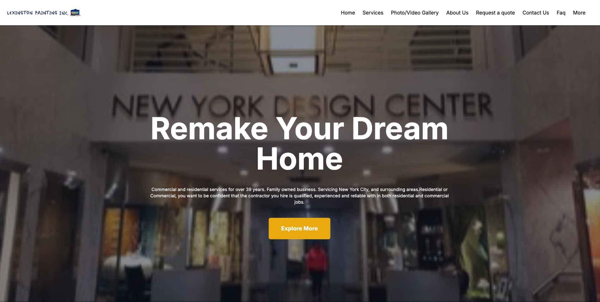

# Lexington painting revamp

## Link
https://lexingtonpaintingapp.netlify.app/

## Before Revamp

## After Revamp
### Desktop View

### Mobile View

## Stack
- Coding: NextJS, TailwindCSS, SASS
- Styling (Ensure the coding style): Eslint, Stylelint

## Explanation
- Since it is a company static website, SEO is mainly one of factor. So I used to nextjs which is a react framework, and mainly used server component for static components

- Eslint, Stylelint and Prettier are used to enforce code style and formatting.

- Prettier rules are integrated into eslint so that we can use eslint --fix to fix the formatting errors. This might not be the best practice, but I like it. Let me know if you have a better solution.

- I also added a pre-commit hook to fix the eslint errors.

## Project Structure
### App
- It is mainly for page routing & page content
- layout.tsx is the entry of Next.js' App router. It contains the global styles and the layout of the app, including the Navbar and Footer.
- page.tsx is the page component of home page and includes different components
### Components
- The components of the page
### Data
- Common data shared by different components, e.g: Navigation items
### Icon
- SVG icons used in components

## Web performance 
