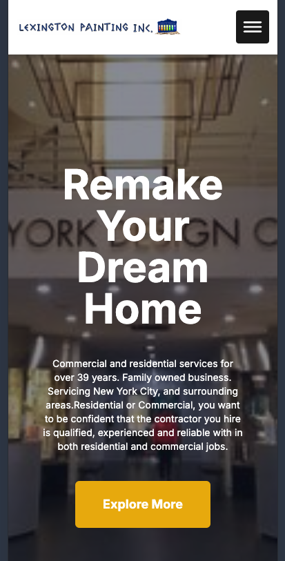
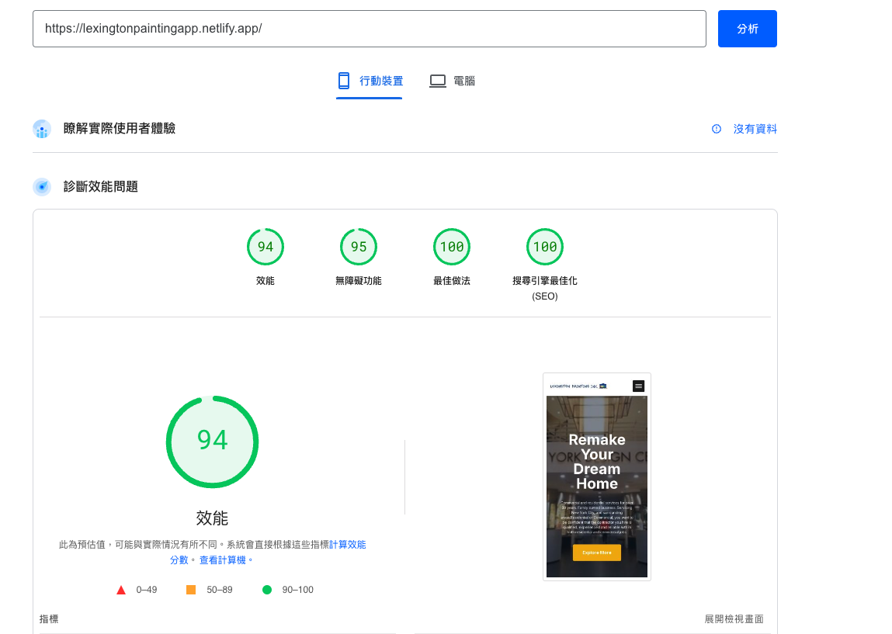

# Lexington painting revamp

## Link
https://lexingtonpaintingapp.netlify.app/

## Before Revamp

## After Revamp

## Stack
- Coding: NextJS, TailwindCSS, SASS
- Styling (Ensure the coding style): Eslint, Stylelint

## Project Structure
- App: Page routing & page content
- Components: Components of the page
- Data: Common data shared by different components, e.g: Navigation items
- Icons: SVG icons

## SEO Practice
- Developed in server components

## Web performance 
